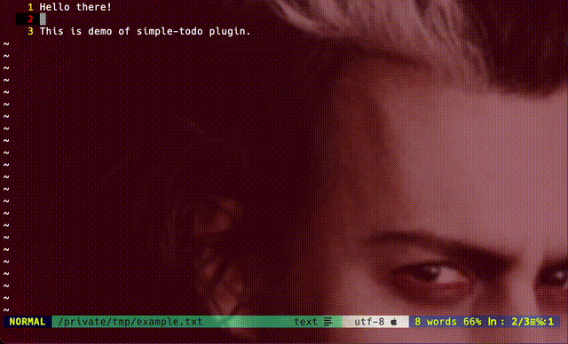

# simple-todo.nvim

A simple and lightweight TODO management plugin for Neovim.

**⚠️ Note:** This is a basic hobby plugin for personal use. Use at your own discretion.

**🎨 Color Note:** This plugin uses terminal colors (ctermfg) for highlighting, which means appearance depends on your terminal's color scheme. If colors don't display correctly or you prefer GUI colors, this plugin might not be ideal for your setup.

## Demo



## Features

- Simple popup window for TODO management
- Severity-based categorization with color coding
- Quick add, list, and delete functionality
- Persistent JSON storage
- Pure Lua/Neovim (no external dependencies)

## Installation

### Using vim-plug

```vim
Plug 'morass/simple-todo.nvim'
```

Then run `:PlugInstall`

### Using packer.nvim

```lua
use 'morass/simple-todo.nvim'
```

### Using lazy.nvim

```lua
{
  'morass/simple-todo.nvim',
  config = function()
    require('simple-todo').setup()
  end
}
```

## Usage

### Commands

- `:SimpleTodoToggle` - Open/close the TODO manager window

### Key Bindings

- `j`/`k` - Navigate up/down
- `Enter` - Select/confirm
- `q` - Go back/close
- `d` - Delete (in delete mode)
- `Escape` - Cancel text input

## Configuration

### Custom TODO storage location

By default, TODOs are stored in Neovim's data directory. You can customize this:

```vim
let g:simple_todo_file = '/path/to/your/todos.json'
```

Or in Lua:

```lua
require('simple-todo').setup({
  file = '/path/to/your/todos.json'
})
```

## Severity Levels

TODOs are color-coded by severity:
- **Critical** (Red) - Urgent tasks
- **Important** (Orange) - High priority tasks
- **Medium** (Green) - Normal priority tasks
- **Minor** (Gray) - Low priority tasks
- **Nice to Have** (Blue) - Optional tasks

## Alternative TODO Plugins

If you need more advanced features, consider these excellent alternatives:

- [**todo-comments.nvim**](https://github.com/folke/todo-comments.nvim) - Highlight and search TODO comments in your code
- [**vim-todo-lists**](https://github.com/aserebryakov/vim-todo-lists) - TODO lists with checkbox support
- [**dooing**](https://github.com/atiladefreitas/dooing) - A more feature-rich TODO manager with categories and persistence
- [**taskwiki**](https://github.com/tools-life/taskwiki) - Combines vim wiki with Taskwarrior for advanced task management
- [**vimwiki**](https://github.com/vimwiki/vimwiki) - Personal wiki with TODO list capabilities

## License

MIT